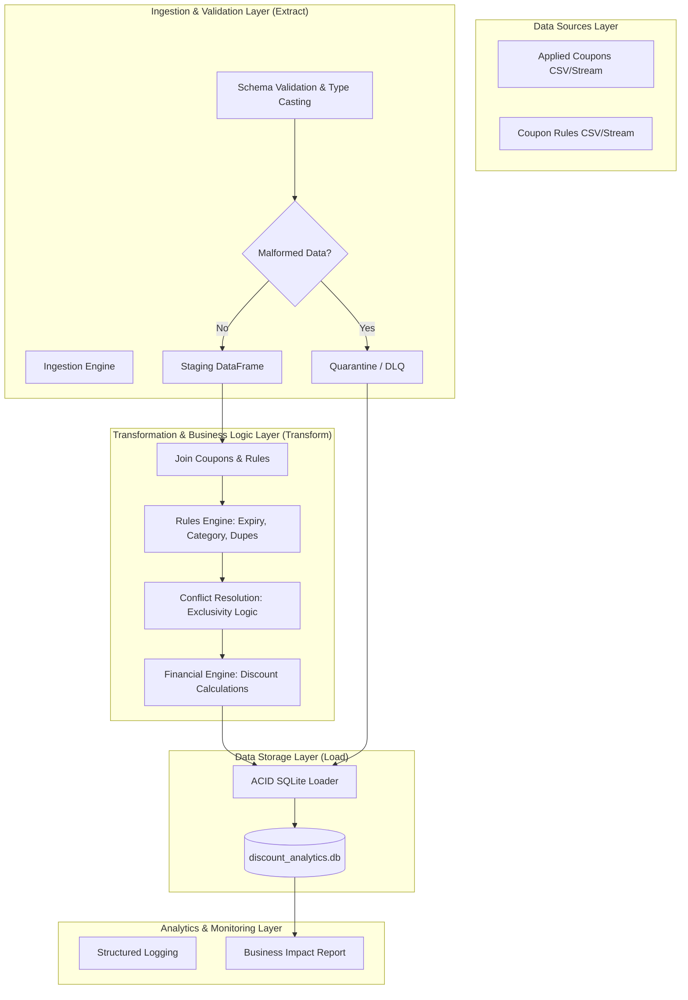

# Discount Validation and Analytics Pipeline: System Architecture

## 1. Executive Summary
This document outlines the production-grade architecture for an automated Discount Validation and Analytics Pipeline. The system is designed to handle complex business rules, resolve exclusivity conflicts between coupons, and maintain high data integrity through strict schema enforcement and a Dead Letter Queue (DLQ) mechanism.

---

## 2. Logical Architecture (ETL Data Flow)

The system follows a modular **Extract-Transform-Load (ETL)** pattern, ensuring a clear separation of concerns between data ingestion, business logic application, and persistence.

---

## 3. Physical Architecture

The pipeline is implemented as a single-node Python application, optimized for high-throughput batch processing using vectorized operations.

- **Processing Engine:** Python 3.12+ utilizing **Pandas** for high-performance data manipulation and **NumPy** for numerical optimization.
- **Validation Engine:** Strict schema enforcement (Pandera-inspired logic) ensures data integrity before the transformation phase.
- **Storage Layer:** **SQLite 3** provides a serverless, transactional (ACID) storage solution for both audit logs and quarantined records.
- **Logging:** Standard library `logging` configured with structured formats for traceability across pipeline execution.

---

## 4. Key Design Decisions & Strategies

### 4.1. Data Ingestion & DLQ Strategy
Production data is often messy. The **Extract** phase performs strict type casting and null checks. Any record failing structural integrity (e.g., negative prices, invalid dates, missing IDs) is immediately routed to a **Dead Letter Queue (DLQ)**. This prevents pipeline crashes while ensuring anomalous data is captured for manual review.

### 4.2. Conflict Resolution (Exclusivity)
When multiple valid exclusive coupons are applied to a single order, the **Rules Engine** implements a **Priority-Based Resolution** logic:
1.  Candidates are ranked by their potential discount value.
2.  The "Winning" coupon (providing the highest value to the customer) is accepted.
3.  Competing coupons are rejected with an `ERR_CONFLICT` status.
- **Complexity:** O(N log N) due to vectorized sorting.

### 4.3. Vectorized Rules Engine
To ensure scalability, the system avoids row-by-row iteration. All validation rules (Expiry, Category Match, Deduplication) are implemented using Pandas bitmasking and vectorized string/date operations.

---

## 5. Deployment & Maintenance
The system is modularized into specialized packages:
- `src/extract.py`: Data ingestion logic.
- `src/transform.py`: Business logic and rules engine.
- `src/load.py`: Database operations.
- `src/analytics.py`: Reporting.

This modularity allows for independent testing of each ETL phase and facilitates future migrations to cloud-native storage (e.g., PostgreSQL, Snowflake) or distributed processing engines (e.g., Apache Spark).
